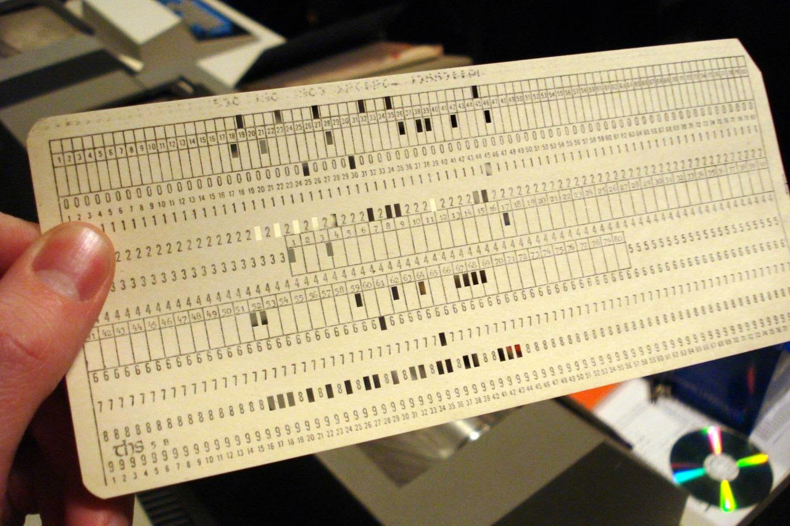
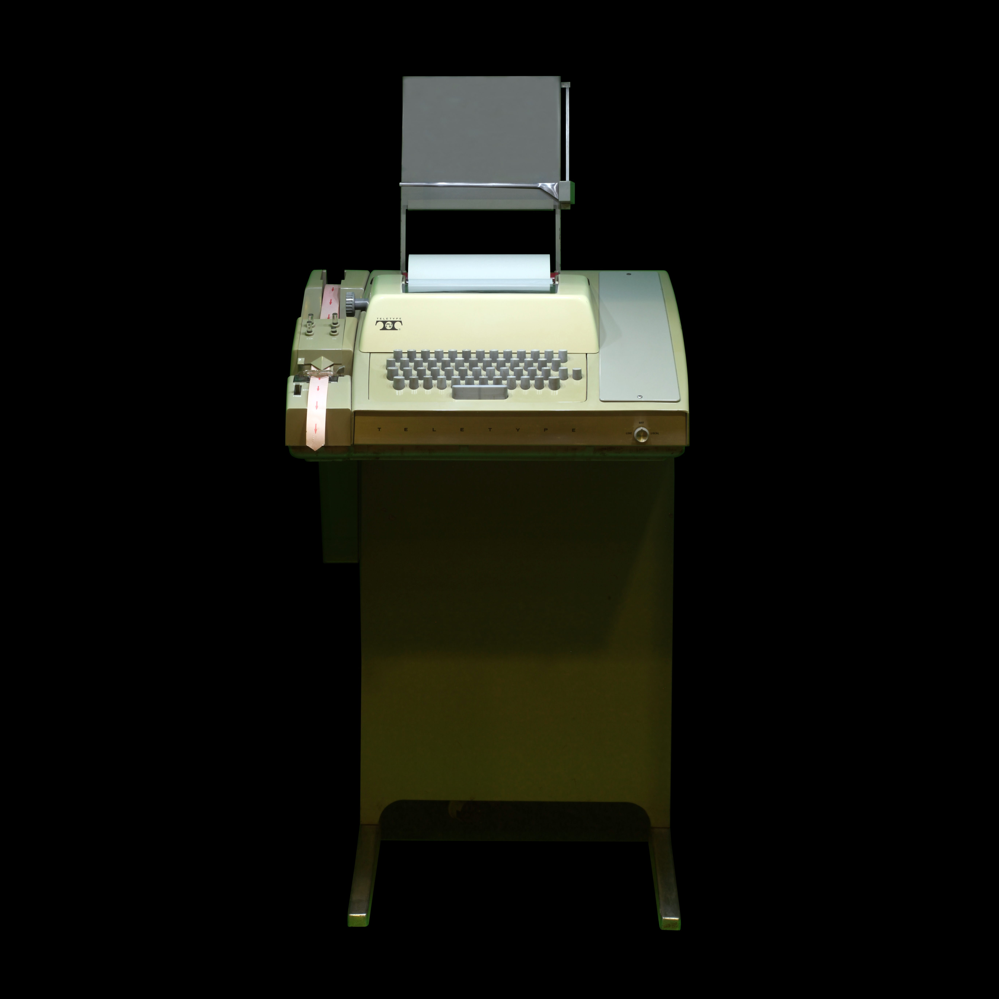
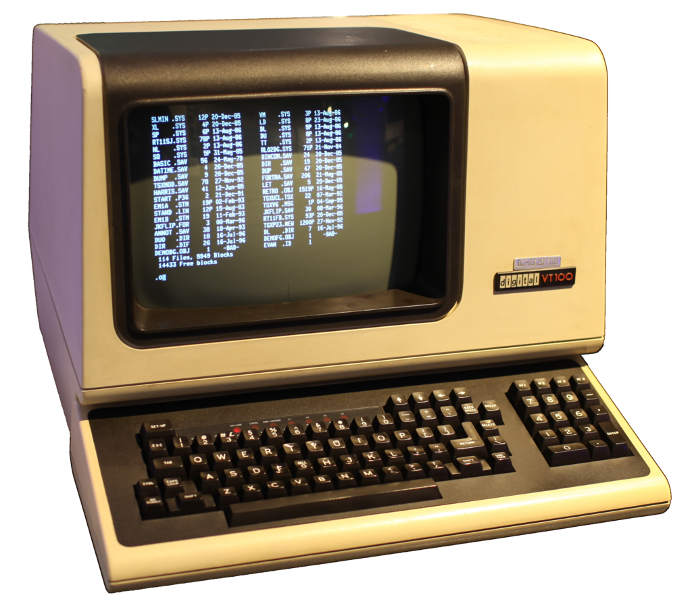
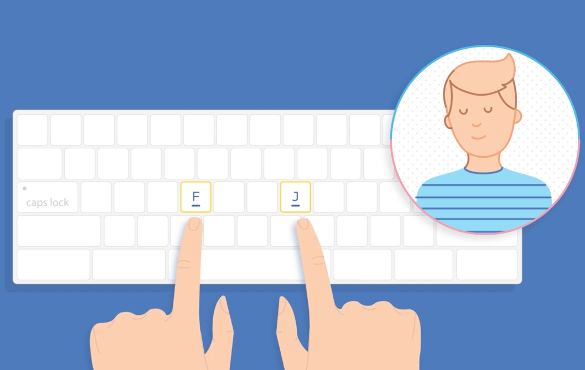
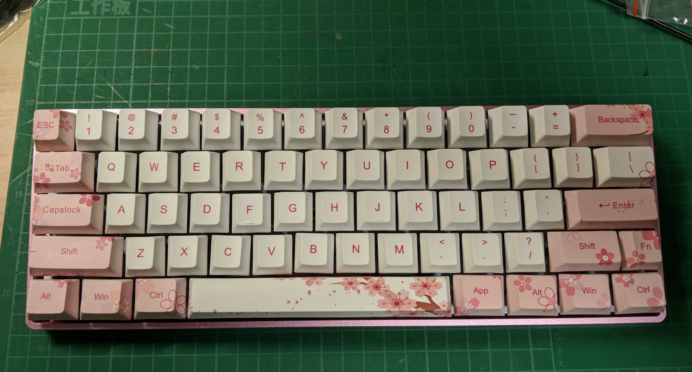
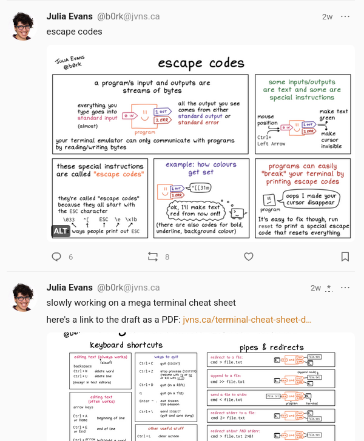

# Highway to shell

Reaching terminal velocity

---

## Vocabulary

<ul>
  <li class="fragment">TTY/terminal</li>
  <li class="fragment">terminal emulator</li>
  <li class="fragment">shell 🐚</li>
  <li class="fragment">CLI</li>
</ul>

Notes:

Let's start with a bit of vocabulary. There is a lot of confusion around the CLI,
so let's clarify a few things.

- TTYs and terminals are physical things that allow you to interact with a computer
- terminal emulator is the modern version, and makes it appear in a window on
  your screen
- inside the terminal, emulated or not, there is a shell that is here to
  interpret your commands
- The shell has a command line interface or CLI

Let us see how we got here.

---

### Punched cards



Notes:

At the beginning, punched cards were used as a way to input data or programs
into a computer. They were impractical because they were physical objects that
would be fed in a batch to a machine that would produce other punched cards or
printouts. One punched card allowed you to write one line of code, maximum 80
chars. Not very handy.

---

### Better input: TTYs



**T**ele**TY**pewriter: 📞+🖨️

`/dev/tty`

Notes:

Teletypewriters are ancient devices that were used to send and receive messages.
They were invented in the 1830s, and were used until the 1980s, when they were
replaced by fax machines and computers.
They transmit text, whereas fax machines transmit a bitmap image.
And since they transmit text, why not plug them to a computer instead of using
them to send messages to other teletypewriters?
That's a way better input method than punched cards.
On most operating systems, they are represented by a file called `/dev/tty`.

---

### Better output: CRT terminals



Notes:

Now that we've got better input, we need better output. Let's just add A CRT
screen to the teletypewriter. That's a terminal. That's still a physical object
separated from the real computer though. At the time it makes sense because the
computer barely fits in a room, and costs a fortune. It can also be called a
console.

---

### Pseudo-TTYs

```console
$ tty
/dev/pts/1
```
- terminal emulators
- `sshd`

Notes:

Today, computer users interact with a graphical interface, but in some cases,
text interfaces are still valuable, especially if you are a developer. Because
of that, some programs allow you to pretend you are using a tty, from
inside your graphical interface. Such programs will request the creation of a
pseudo-TTY, or PTY, which will result in a `/dev/pts/` file, and a `ptm` file.
The `m` stands for master, and the `s` for `slave`… don't ask me why they
thought slavery was the best metaphor for this.
The 2 most common types of programs that use PTYs are terminal emulators and
`sshd`, the SSH daemon, which exposes a shell to remote users.
Fun experiment: try opening 2 terminal emulators, and run `tty` in both of them.
Then try communicating between them with `echo`.

---

### Default terminal emulators

- `gnome-terminal`
- `konsole`
- `Terminal.app`

Notes:

Just to confirm that you know what I'm talking about, here are some examples of
terminal emulators that come pre-installed on some operating systems.

---

### Terminal emulators I've used

- `alacritty`
- `wezterm`
- `ghostty`

Notes:

Here are some terminal emulators I have used. My main criterias for picking one
are:

- it should be easy to paste to it
- it should be easy to copy from it
- it should be easy to search text in it

---

shell + kernel = operating system


Notes:

When talking about Linux, we often refer to it as the kernel, the inner part of
the operating system. The shell is the outer part, the interface with the world.
The shell is a command-oriented programming language that allows you to interact
with the operating system.

---

### The Command Line Interface

<ul>
  <li class="fragment"><code>&lt;</code> input: text </li>
  <li class="fragment"><code>&gt;</code> output: text </li>
</ul>

<p class="fragment">Text is 👑</p>
<p class="fragment"><code>program_1 | program_2 | program_3</code></p>

Notes:

The main way to use the shell is interactively, through the command line
interface. The secondary way is through scripts, which are files that contain
shell scripts.

The input of a command line program is text, and its outputs are text as well.
So text is king. And the cool thing is you can plug the output of one program
to another, with this little pipe character. You can compose small programs
together to build more complex programs that do exactly what you want.

---

### 3 streams

<ul>
  <li class="fragment"><code>stdin (0)</code></li>
  <li class="fragment"><code>stdout (1)</code></li>
  <li class="fragment"><code>stderr (2)</code></li>
  <li class="fragment">👆 bad name (<code>stdnotify</code>?)</li>
</ul>

Notes:

So there are three streams. First, the standard input stream, which can be
plugged directly to the user, or to the output of another program with a pipe.
Then we have 2 streams where our program can write: the so-called standard output
stream, and we have the badly called standard error stream.

I'm saying it's badly called because if you have a program that must output a
piece of JSON, but also can output a nice green success notification to the
user, it should print that notification to the standard error stream.

That way, you can still pipe the JSON to another program, and the user will
still see the notification, and the program that consumes the JSON will not be
confused by the notification.

---

### Redirections

- `>` overwrite a file
- `>>` append to a file
- `<` read from a file

Notes:

Streams can be redirected to files.

---

Cool stuff you can do with `>`

<ul>
  <li class="fragment"><code>program > file</code></li>
  <li class="fragment"><code>echo "" > /var/log/huge_file.log</code></li>
  <li class="fragment"><code>program 2>&1</code> redirect stderr to stdout</li>
  <li class="fragment"><code>program >/dev/null 2>&1</code> silence everything 🤐</li>
</ul>


Notes:

So the classic thing you can do with `>` is to redirect the output of a program
to a file, if you want to share it with your friends and family.

Careful though, it will overwrite the file if it exists. That's actually a
cool way to empty a file without deleting it, in case deleting it would break
the program writing to it.

Personal anecdote: I was once away from keyboard and had to spell this one out
to a colleage at midnight over the phone to get the website of the company we
worked for back on track. He was a graphic designer so… that was fun!

Note that on Linux, everything is a file, and the streams we mentioned can be
referred to as numbers. So `2>&1` means "redirect the standard error to the
same place as stdout". If you remove the ampersand, it will create a file
called `1` and write the output to it.

---

### Signals

- `Ctrl-C`: send `SIGINT` to the foreground process 🛑
- `SIGKILL` is the nuclear option 💣
- `SIGTERM` ~= `SIGINT`
- `Ctrl-Z`: send `SIGTSTP` to the foreground process ⏸️

Notes:

Signals are a way to communicate with a process. The most common one is `SIGINT`,
which you can send quickly with `Ctrl-C`. It's a polite way to ask a program to
stop.
If the program does not listen to `SIGINT`, you can send `SIGKILL`, but there
is no shortcut for that, so you will need first to find its PID with `ps` or
`pgrep`, and then send the signal with `kill`. Or you can use `htop`, it's a
nice way of doing that with a TUI.
`SIGTERM` is very similar to `SIGINT`, but is usually sent from another
program, for instance at ManoMano, it is sent a bit before an EC2 instance
shuts down.
When it happens your program has some time to do some cleanup and/or save its
progress (if it's a cronjob).
Ctrl-Z is a way to pause a program, and you can resume it with `fg` (like
foreground). When I work in NeoVim, I use it to get back to the shell, and then
I can get back to NeoVim with `fg`.

---

### GNU readline

- used by most programs that come with a CLI
- available as a library in most languages

<video autoplay loop>
    <source src="node.webm" type="video/webm"/>
    Video not supported.
</video>

Notes:

Note that having a command line interface is not unique to the shell. For
instance, if you run `node`, you will get into a Read-Eval-Print Loop, which
allows you to run Node JS snippets. This is not a shell, but it is a CLI. In
both cases, the GNU readline library is used to provide the user with a way to
edit a line and submit it.

---

### A small Node.js CLI

```javascript
const readline = require('node:readline');
const { stdin: input, stdout: output } = require(
  'node:process'
);

const rl = readline.createInterface({ input, output });

rl.question('What do you think of Node.js? ', (answer) => {
  // TODO: Log the answer in a database
  console.log(`Thank you for your feedback: ${answer}`);

  rl.close();
});
```

Notes:

Here is an example of how you can build your own little Node JS command line
interface using readline. Using that library means you can use the same
shortcuts that are also used in other CLI programs.

---

### The shell

- command-oriented (`true`, `false` and `[` are executable files)
- scripting language (`if`, `for`, `while` are built-in)

Notes:

The shell is command-oriented, to the point that even `true`, `false`, or `[`
are executable files. Not all shells resort to them though.
You should use it if you have a small task to automate, where what you do is
calling binaries and passing arguments to them.

---

Reasons not to use shell scripts 👎

<ul>
  <li class="fragment">not portable (GNU <code>grep</code> 🐧 vs BSD <code>grep</code> 🍏)</li>
  <li class="fragment">hard to write</li>
  <li class="fragment">hard to unit test</li>
  <li class="fragment">hard to read when inside a pipeline YML file</li>
</ul>

Notes:

Writing long shell scripts might not be a good idea. Bash scripts are
appropriate for really small tasks you need to automate, where what you do is
piping programs into other programs but if it gets a bit long, consider Python
or Go.

If you go the shell script route, you will have to deal with the fact that the
programs you are calling might behave slightly differently on different systems.
Also, what you will have to deal with is the weird syntax of the shell.
Writing an `if` statement in the shell is not as straightforward as in Python.
Also, since it's not really a programming language, it's hard to unit test, so
people usually don't.
And finally, it may even be hard to read, typically if the shell script is
inside a YAML file. You can get syntax higlighting with Treesitter, but right
now, you won't have it in Gitlab, for code review, as far as I know.

---

### Moving around

- `Ctrl-A` go to the beginning of the line
- `Ctrl-E` go to the end of the line
- `Ctrl-B` or `⬅️` go back one character
- `Ctrl-F` or `➡️` go forward one character
- `Ctrl-⬅️` go back one word
- `Ctrl-➡️` go forward one word

🍏 : `Option-⬅️` or `Option-➡️`

Notes:

Let us see how to move around in a command line.
By default, since it's GNU readline, the shortcuts are the same as in GNU emacs.
Most shells also offer a vi mode, and personally I do not use it because I want
to be able to intervene in setups that are not mine.

---

### Cutting (and pasting)

- `Ctrl-U` delete from the cursor to the beginning of the line
- `Ctrl-K` delete from the cursor to the end of the line
- `Ctrl-W` delete the word before the cursor
- `Ctrl-D` delete the character under the cursor
- `Ctrl-Y` paste the last deleted text

---

### Moving through history 🕰️

- `Ctrl-P` or `⬆️` previous command
- `Ctrl-N` or `⬇️` next command
- `Ctrl-R` search history

Notes:

`Ctrl-R` is the most useful here. You can use the up and down arrows, but it's
not quite as efficient.

---

### Moving around the filesystem

```console
$ cd path/to/directory # change directory
$ cd -                 # go back to the previous directory
$ cd ..                # go up one directory
$ cd /                 # go to the root directory
$ cd ~                 # go to your home directory
$ cd                   # same
```

Notes:

You probably already know about these `cd` commands, except maybe `cd -`? It's
very handy, and is mirrored in some git commands such as `git switch -`, which
allows to go back to the previous branch.

---

### Moving around the filesystem with ZSH

```console
$ path/to/directory # change directory
$ -                 # go back to the previous directory
$ ..                # go up one directory
$ ...               # go up two directories
$ ....              # go up three directories
$ /                 # go to the root directory
$ ~                 # go to your home directory
$ cd                # same
```

Notes:

If you use ZSH, you can actually omit the `cd` part of the command in most cases.
There are also extra shortcuts allowing going up more than one directory.

---

### Editing files

- ~`nano`~ `micro` is the most user-friendly
- Vim, Emacs, NeoVim, Helix are more powerful

Notes:

Using readline is great, but at some point, you will want something even more
comfortable to edit longer pieces of text.

A lot of tools will take the `$EDITOR` variable into account,
you can define it in your shell configuration file.

---

```shell
# ~/.bashrc or ~/.zshrc or ~/.fishrc or ~/.config/fish/config.fish
export EDITOR=micro # easy mode first, change me later
```

- `sudo -e /etc/hosts` to edit `/etc/hosts` as an admin in your `$EDITOR` 🤯
- `Ctrl-X Ctrl-E` to edit a command in your `$EDITOR` 🤯🤯

Notes:

For instance, if you want to edit a file as root, but still use your favorite
editor will all the plugins you have, you can use `sudo -e`, that will open a
file in `/tmp`, and as soon as you close your editor, it will overwrite the
file you wanted to edit.

Another example is the extremely powerful `Ctrl-X Ctrl-E` shortcut. It allows
you to edit a command line inside your favorite editor.

---

### Using autocomplete

```console
$ cd path/to/dir<TAB> # completes to `cd path/to/directory`
```

Notes:

When you navigate, you should always use autocomplete. Not only is it faster,
but it allows you to confirm that a directory or file exists.

---

### Modernizing your shell

| 👴           | 😎                    |
|--------------|-----------------------|
| `Ctrl+R`     | `fzf` / `mcfly`       |
| -            | `zsh-autosuggestions` |
| `cat`/`less` | `bat`                 |
| `cd`         | `zoxide`              |
| `grep`       | `rg` (ripgrep)        |
| `find`       | `fd`                  |
| `man`        | `tldr`                |

Notes:

Now, we've seen the basics of the shell, and we've seen things that have been
around for decades. That does not mean there is nothing new in the shell world.
In fact, there are lots of new tools that are improvements over the old ones.

For me, the one that has the most impact is `fzf`. You probably do not need it
if you are using `fish`, which seems to come with an already decent history
search, but if you are using `bash` or `zsh`, you should definitely install it.

---

### Getting fast

>  If you don't think carefully, you might believe that programming is just
>  typing statements in a programming language.
> &mdash; Ward Cunningham

Notes:

There are many reasons for using the CLI over GUIs, and one of them is speed.
Make no mistake, the goal is not really speed in and of itself, because most
time spent working on a program is spent thinking, not typing.
The goal is more to reduce friction: if you are fast at what you do, if every
action is a reflex, then you no longer have to focus on the details of doing
your task, and you can think about it at a higher level.
Working with the CLI is one way to get faster, let's see a few other ways you
can get faster.

---

### Touch typing

Feel the bumps on the `F` and `J` keys? 😌



Notes:

The first one is touch typing.
Not having to look at the keyboard is a huge time saver. It means you notice
your mistakes earlier, because you are looking at the screen.
There are several websites that can help you with that, like typingclub.com

---

### Picking a keyboard

Special chars (`({[\|]})`) are easier to access



Notes:

This is a 60% keyboard. It has no number pad, no function keys, and no arrow
keys. The consequence is that it is possible to reach every key on the keyboard
without moving your hands. This is a huge time saver.
With `QWERTY` you have easy access to special characters, worst case scenario
you will have to press shift.

---

### Learn a modal editor

- `neovim`
- `helix`

Notes:

This warrants a whole talk, but the main thing about so-called modal editors is
that they have modes: there is an insert mode, which is the one you are used to,
but also a normal mode, which allows you to use keys not for inserting text,
but for manipulating it, and without having to use modifiers like `Ctrl` or
`Shift`.

---

Follow Julia Evans on Mastodon

`@b0rk@jvns.ca`



Notes:

If you want to learn more about the command line and other technical topics
such as HTTP or linux, I highly recommend following this lady on social media.

---

### Final thoughts

Notes:

That's the end of this talk, I hope you learned something new, and that you are
ready to get to the next level with your CLI skills. If you have any questions
or remarks to share, now is the time!
